<div align="center">

<h3><code>Tarushi12-ux@github ~ $ ./contributions.sh</code></h3>


<br><br>

<h3><code>Tarushi12-ux@github ~ $ whoami</code></h3>

<table>
<tr>
<td valign="top">

</td>
<td valign="top">

</td>
</tr>
</table>

</div>

<br>

## 👨‍💻 About Me

Hello, I'm **Tarushi**! I am a developer and student focused on **Computer Vision, Deep Learning, and Real-Time Systems**. I love building intelligent software, optimizing edge models, and solving complex engineering challenges.

- 🎓 **Education**: B.Tech in Computer Science / Artificial Intelligence
- 💡 **Focus**: Deep Learning, Real-Time Object Detection, and Robotics
- ⚙️ **Workflow**: Terminal enthusiast, clean code advocate, and open-source learner

---

## 🛠 Tech Stack

```text
Languages     : Python, C++, SQL, HTML/CSS, JavaScript
AI & ML       : PyTorch, OpenCV, YOLO, Torchvision, Scikit-Learn
Tools & Ops   : Git, Linux/Bash, Docker, VS Code, GitHub Actions
```

---

## 🚀 Featured Projects

- 🎯 **[Campus Object Detection](https://github.com/Tarushi12-ux/Campus_Object_Detection)** — Real-time detection & localization pipeline optimized for edge campus monitoring.
- 🤖 **[air-script-ai](https://github.com/Tarushi12-ux/air-script-ai)** — AI-driven automation scripts for intelligent task execution.
- 🛸 **[Drone Robotics Intelligence Platform](https://github.com/Tarushi12-ux/drone-robotics-intelligence-platform)** — Autonomous navigation and computer vision telemetry for drone operations.

---

## 📚 Currently Learning & Exploring

- ⚡ **Model Optimization**: TensorRT, ONNX Runtime, and INT8 quantization for real-time inference.
- 🤖 **Robotics & ROS2**: Integrating vision pipelines with autonomous robotic controllers.

---

## 📫 Connect with Me

- 💼 **GitHub**: [@Tarushi12-ux](https://github.com/Tarushi12-ux)
- 📧 **Email**: Contact via GitHub Profile

---

<div align="center">
<sub>⚡ Profile graphics auto-generated via self-contained animated SVGs &amp; refreshed daily with GitHub Actions.</sub>
</div>
