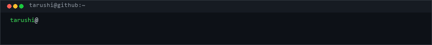
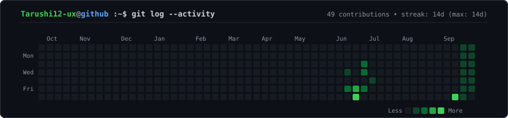
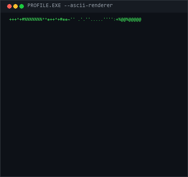
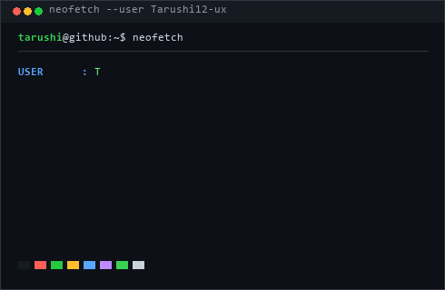

  

  

<table>
<tr>
<td valign="top" align="center">

</td>
<td valign="top" align="center">

</td>
</tr>
</table>

 

## 💻 About Me

Developer focused on building intelligent vision systems, automation tools, and real-time AI pipelines. Interested in solving practical engineering problems through computer vision and clean software architecture.

- 🎯 **Focus**: Computer Vision & AI Development
- ⚡ **Workflow**: Linux terminal, modular Python architecture, and version-controlled pipelines

---

## 🎓 Education

- **Master of Computer Applications (MCA)**
- **Bachelor of Computer Applications (BCA)**

---

## 🛠 Tech Stack

| Category | Technologies |
| :--- | :--- |
| **Languages** | `Python` • `JavaScript` • `HTML5 / CSS3` |
| **AI & Vision** | `PyTorch` • `OpenCV` • `Computer Vision` |
| **Web** | `React` • `HTML` • `CSS` |
| **Tools** | `Git` • `GitHub` • `Linux / Bash` • `VS Code` |

---

## 🚀 Featured Projects

- 🎯 **[Campus Object Detection](https://github.com/Tarushi12-ux/Campus_Object_Detection)** — Real-time detection & localization pipeline optimized for campus environments. *(Python, PyTorch, OpenCV)*
- 🤖 **[air-script-ai](https://github.com/Tarushi12-ux/air-script-ai)** — Intelligent AI scripting tools and automation frameworks. *(Python)*
- 👁️ **[falco](https://github.com/Tarushi12-ux/falco)** — Computer vision & intelligence platform. *(Python, OpenCV)*

---

## 📫 Connect

- 💻 **GitHub**: [@Tarushi12-ux](https://github.com/Tarushi12-ux)

---

⚡ Profile graphics auto-rendered via dynamic terminal animations &amp; refreshed daily via GitHub Actions.

